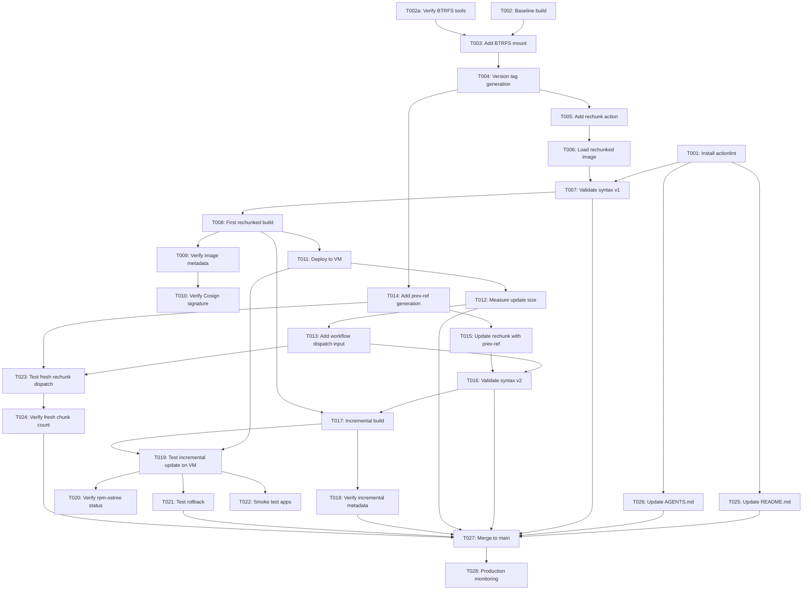

# Tasks: Add Rechunking to Reduce Update Sizes

**Feature Branch**: `001-add-rechunking-to`  
**Generated**: 2025-01-18  
**Status**: Ready for Implementation  
**Estimated Total**: 29 tasks (updated from 28 after analysis fixes)

## Task Organization Strategy

This feature is organized into **5 phases** corresponding to the 4 prioritized user stories plus setup/polish:

1. **Phase 1 - Setup**: Shared infrastructure needed by all user stories (workflow setup, syntax validation)
2. **Phase 2 - User Story 1 (P1)**: Faster System Updates - Core rechunking integration for 5-10x update size reduction
3. **Phase 3 - User Story 2 (P1)**: Transparent CI/CD Integration - Automated prev-ref generation and metadata handling
4. **Phase 4 - User Story 3 (P2)**: Transparent User Experience - VM deployment validation and rollback testing
5. **Phase 5 - User Story 4 (P3)**: Fresh Rechunking on Major Updates - Workflow dispatch parameter for monthly maintenance
6. **Phase 6 - Polish**: Documentation updates and cross-cutting concerns

**Minimum Viable Product (MVP)**: Complete Phase 1 + Phase 2 only. This delivers the core value—5-10x smaller updates—and can be independently validated without subsequent phases.

**Parallel Execution**: Tasks marked with `[P]` can be executed in parallel with other `[P]` tasks in the same phase if they modify different files.

---

## Phase 1: Setup & Prerequisites

**Goal**: Establish local validation tooling and verify baseline workflow

**Story**: N/A (Infrastructure)

### T001: [X] [Setup] Install actionlint for Workflow Syntax Validation

**File(s)**: Local development environment

**Description**: Install actionlint (GitHub Actions workflow linter) on development machine to enable local syntax validation before pushing workflow changes. Follow installation instructions from https://github.com/rhysd/actionlint.

**Commands**:
```bash
# macOS
brew install actionlint

# Linux
curl -LO https://github.com/rhysd/actionlint/releases/latest/download/actionlint_linux_amd64.tar.gz
tar xzf actionlint_linux_amd64.tar.gz
sudo mv actionlint /usr/local/bin/

# Verify installation
actionlint --version
```

**Acceptance**: `actionlint --version` returns version 1.6.0 or later

**Dependencies**: None

---

### T002: [Setup] Verify Baseline Workflow Executes Successfully

**File(s)**: `.github/workflows/build.yml` (existing, no changes)

**Description**: Trigger a baseline build via GitHub Actions to establish current workflow behavior before rechunking integration. Capture workflow execution time and verify successful GHCR push and Cosign signing. This serves as the performance baseline for SC-002 (rechunking overhead <8 minutes).

**Steps**:
1. Navigate to GitHub Actions → Build workflow
2. Click "Run workflow" → Select `main` branch
3. Monitor execution and note total duration
4. Verify image published to `ghcr.io/dkolb/bazzite-dkub` with latest tag
5. Verify Cosign signature using `cosign verify --key cosign.pub ghcr.io/dkolb/bazzite-dkub:latest`
6. **Record baseline duration** for SC-002 comparison (save to notes or issue comment)

**Acceptance**: Baseline build completes successfully, image published and signed, total duration recorded for comparison with T008

**Dependencies**: None

---

### T002a: [X] [Setup] Verify BTRFS Tools Available on Runner

**File(s)**: GitHub Actions runner environment (validation only)

**Description**: Verify that BTRFS tools are available on GitHub Actions ubuntu-latest runner before attempting filesystem operations. This addresses the edge case "What if GitHub Actions runner lacks BTRFS support?" from spec.md. While ubuntu-latest includes BTRFS by default, explicit validation prevents cryptic mount errors.

**Commands**:
```bash
# Check BTRFS tools availability
which mkfs.btrfs || echo "ERROR: mkfs.btrfs not found"
which btrfs || echo "ERROR: btrfs command not found"

# Verify BTRFS kernel module loaded
lsmod | grep btrfs || echo "WARNING: BTRFS kernel module not loaded"
```

**Expected**: All commands succeed, BTRFS tools available

**Acceptance**: `mkfs.btrfs` and `btrfs` commands found in PATH, kernel module loaded

**Dependencies**: None (can run in parallel with T002)

**Parallel**: [P] - Can run alongside T002 baseline build

---

## Phase 2: User Story 1 (P1) - Faster System Updates

**User Story**: As a bazzite-dkub user, I want 5-10x smaller update downloads.

**Story Goal**: Integrate core rechunking functionality to reduce update sizes from ~2GB to 200-400MB for minor changes.

**Independent Test Criteria**: 
- Build a rechunked image
- Deploy to test VM
- Make trivial change (e.g., update README.md timestamp)
- Build again
- Measure update download size via `rpm-ostree upgrade --check-diff`
- **Success**: Download size reduced by 5-10x compared to baseline (SC-001)

### T003: [X] [US1] Add BTRFS Mount Step to Workflow

**File(s)**: `.github/workflows/build.yml`

**Location**: After "Build Image" step (typically after `buildah` or `podman build` step)

**Description**: Add workflow step to mount a 50GB BTRFS filesystem required by hhd-dev/rechunk for efficient copy-on-write operations during chunking. Reference: `quickstart.md` Step 1.2.

**Changes**:
```yaml
    - name: Mount BTRFS Storage for Rechunking
      run: |
        echo "Creating 50GB BTRFS filesystem for rechunking..."
        sudo mkdir -p /var/tmp/rechunk-btrfs
        sudo truncate -s 50G /var/tmp/rechunk.img
        sudo mkfs.btrfs /var/tmp/rechunk.img
        sudo mount -o loop /var/tmp/rechunk.img /var/tmp/rechunk-btrfs
        sudo chmod 777 /var/tmp/rechunk-btrfs
        echo "BTRFS mounted at /var/tmp/rechunk-btrfs"
        df -h /var/tmp/rechunk-btrfs
```

**Acceptance**: Step runs successfully on GitHub Actions ubuntu-latest runner, BTRFS mounted at `/var/tmp/rechunk-btrfs`

**Dependencies**: T002a (BTRFS tools verified), T002 (baseline workflow verified)

---

### T004: [X] [US1] Add Version Tag Generation Step

**File(s)**: `.github/workflows/build.yml`

**Location**: After BTRFS mount step

**Description**: Add step to generate semantic version tag in format `40-YYYYMMDD` (Fedora 40 prefix + 8-digit date where YYYYMMDD = 4-digit year + 2-digit month + 2-digit day). This tag will be used for both image tagging and prev-ref queries in subsequent builds. Reference: `quickstart.md` Step 1.3.

**Changes**:
```yaml
    - name: Generate Version Tag
      id: generate-version
      run: |
        TAG="40-$(date +%Y%m%d)"
        echo "tag=$TAG" >> $GITHUB_OUTPUT
        echo "Generated version tag: $TAG"
```

**Note**: Ensure step has `id: generate-version` for reference in later steps.

**Acceptance**: Step outputs version tag matching pattern `40-YYYYMMDD` (e.g., `40-20250118`)

**Dependencies**: T003 (BTRFS mount exists)

---

### T005: [X] [US1] Add Rechunking Action Step with Basic Configuration

**File(s)**: `.github/workflows/build.yml`

**Location**: After version generation step, BEFORE "Push to GHCR" step

**Description**: Add hhd-dev/rechunk action step to perform OCI layer rechunking. Start with basic configuration using hardcoded empty `prev-ref` (fresh rechunking mode) to validate rechunking works before adding incremental optimization. Use SHA-pinned version for security (v1.2.4 = `5fbe1d3a639615d2548d83bc888360de6267b1a2`). Reference: `contracts/workflow-contract.md` Step 5.

**Changes**:
```yaml
    - name: Run Rechunker
      id: rechunk
      uses: hhd-dev/rechunk@5fbe1d3a639615d2548d83bc888360de6267b1a2  # v1.2.4 pinned SHA
      with:
        rechunk: 'ghcr.io/hhd-dev/rechunk:v1.2.4'
        ref: "localhost/bazzite-dkub:${{ env.DEFAULT_TAG }}"
        prev-ref: ''  # Empty for fresh rechunking (will be replaced in T009)
        version: '${{ steps.generate-version.outputs.tag }}'
        labels: ${{ steps.metadata.outputs.labels }}
      timeout-minutes: 10
```

**Important**: Replace `${{ env.DEFAULT_TAG }}` with actual tag from metadata step if `DEFAULT_TAG` env var not defined in workflow.

**Acceptance**: Rechunking step executes successfully, completes within 10 minutes

**Dependencies**: T004 (version tag generated)

---

### T006: [X] [US1] Add Rechunked Image Load and Tag Step

**File(s)**: `.github/workflows/build.yml`

**Location**: Immediately after rechunking step

**Description**: Load the rechunked image from OCI directory output by rechunk action, clean up temporary files, and tag with all metadata tags. This replaces the original built image with the rechunked version before push. Reference: `quickstart.md` Step 1.6.

**Changes**:
```yaml
    - name: Load rechunked image in podman and tag
      run: |
        echo "Loading rechunked image from OCI directory..."
        IMAGE=$(podman pull ${{ steps.rechunk.outputs.ref }})
        echo "Loaded rechunked image: $IMAGE"
        
        # Clean up rechunk temporary output directory
        sudo rm -rf ${{ steps.rechunk.outputs.output }}
        
        # Tag rechunked image with all tags from metadata step
        for tag in ${{ steps.metadata.outputs.tags }}; do
          echo "Tagging as: $tag"
          podman tag $IMAGE $tag
        done
        
        echo "Rechunked image ready for push"
```

**Acceptance**: Rechunked image loaded into Podman and tagged with all metadata tags

**Dependencies**: T005 (rechunking action completes)

---

### T007: [X] [US1] Validate Workflow Syntax with actionlint

**File(s)**: `.github/workflows/build.yml` (validation only, no changes)

**Description**: Run actionlint locally to validate workflow syntax before pushing changes. Fix any YAML indentation errors, undefined step ID references, or missing variable syntax. Reference: `quickstart.md` Step 2.

**Commands**:
```bash
cd /var/home/dkub/code/github/dkolb/bazzite-dkub
actionlint .github/workflows/build.yml
```

**Acceptance**: actionlint returns zero errors (warnings about shellcheck acceptable)

**Dependencies**: T001 (actionlint installed), T003-T006 (workflow modifications complete)

---

### T008: [US1] Trigger First Rechunked Build and Verify Success

**File(s)**: GitHub Actions workflow execution (no file changes)

**Description**: Commit workflow changes, push to feature branch, and trigger first rechunked build via GitHub Actions workflow dispatch. Monitor execution for successful rechunking step completion, GHCR push, and Cosign signing. Compare total workflow duration against T002 baseline to validate SC-002 (rechunking overhead <8 minutes). Reference: `quickstart.md` Step 3.

**Steps**:
1. Commit workflow changes: `git add .github/workflows/build.yml && git commit -m "feat(US1): add basic rechunking integration (fresh mode)"`
2. Push to feature branch: `git push origin 001-add-rechunking-to`
3. Navigate to GitHub Actions → Build workflow → Run workflow
4. Set branch: `001-add-rechunking-to`
5. Click "Run workflow"
6. Monitor logs for:
   - ✅ BTRFS mount succeeds (~10 seconds)
   - ✅ Version tag generated (e.g., `40-20250118`)
   - ✅ Rechunking completes in 5-7 minutes (fresh mode)
   - ✅ Image loaded and tagged
   - ✅ Pushed to GHCR
   - ✅ Cosign signing succeeds

**Acceptance**: Build completes successfully, total duration 12-18 minutes (build 8-10 min + rechunk 5-7 min + push/sign 2-3 min)

**Dependencies**: T007 (workflow syntax validated)

---

### T009: [US1] Verify Rechunked Image Properties with Skopeo

**File(s)**: N/A (inspection only)

**Description**: Inspect published rechunked image using skopeo to verify OCI labels include rechunking metadata. Validates FR-004 (OCI labels) and SC-005 (metadata verification). Reference: `quickstart.md` Step 4.

**Commands**:
```bash
# Get current date tag
TAG="40-$(date +%Y%m%d)"

# Inspect image
skopeo inspect docker://ghcr.io/dkolb/bazzite-dkub:$TAG | jq

# Verify standard OCI labels
skopeo inspect docker://ghcr.io/dkolb/bazzite-dkub:$TAG | jq '.Labels | {
  title: .["org.opencontainers.image.title"],
  version: .["org.opencontainers.image.version"],
  url: .["org.opencontainers.image.url"],
  build_url: .["io.github-actions.build.url"]
}'

# Verify rechunking metadata
skopeo inspect docker://ghcr.io/dkolb/bazzite-dkub:$TAG | jq '.Labels | {
  rechunk_version: .["rechunk.version"],
  rechunk_chunks: .["rechunk.chunks"],
  rechunk_prev_ref: .["rechunk.prev-ref"]
}'
```

**Expected**: 
- Standard labels present: title, version, url, build_url
- Rechunking metadata present: rechunk.version="v1.2.4", rechunk.chunks="7-10", rechunk.prev-ref="" (empty for fresh mode)

**Acceptance**: All required OCI labels present with correct values

**Dependencies**: T008 (first rechunked build published)

---

### T010: [US1] Verify Cosign Signature on Rechunked Image

**File(s)**: N/A (verification only)

**Description**: Verify that Cosign signing occurs AFTER rechunking and signs the final rechunked image, not the original build. Validates edge case: "How does rechunking interact with Cosign signing?" Reference: `quickstart.md` Step 4.3.

**Commands**:
```bash
TAG="40-$(date +%Y%m%d)"
cosign verify --key cosign.pub ghcr.io/dkolb/bazzite-dkub:$TAG
```

**Expected**: Signature verification success with build information

**Acceptance**: Cosign verification succeeds for rechunked image

**Dependencies**: T009 (rechunked image inspected)

---

### T011: [US1] Deploy Rechunked Image to Test VM

**File(s)**: Test VM deployment (no code changes)

**Description**: Build QCOW2 VM image with rechunked base or rebase existing bazzite-dkub VM to rechunked image. Verify system boots successfully and applications work. Establishes baseline for incremental update testing. Reference: `quickstart.md` Step 6.1-6.3.

**Steps**:
```bash
# Option A: Fresh VM (if testing clean install)
just build-qcow2
just run-vm-qcow2

# Option B: Rebase existing system (recommended)
# On VM:
sudo rpm-ostree rebase ghcr.io/dkolb/bazzite-dkub:latest
systemctl reboot

# After reboot, verify deployment
rpm-ostree status
```

**Acceptance**: VM boots into rechunked deployment, `rpm-ostree status` shows rechunked image version

**Dependencies**: T008 (rechunked image published)

---

### T012: [US1] Measure Update Download Size for Trivial Change

**File(s)**: Test VM (measurement), `README.md` (trivial change for trigger)

**Description**: Make a trivial change (e.g., update README.md timestamp), build new rechunked image, and measure update download size on test VM. **This validates SC-001 (5-10x reduction) - the primary success criterion for User Story 1.** Reference: `quickstart.md` Step 6.4-6.5.

**Steps**:
```bash
# On development machine: Make trivial change
echo "<!-- Last updated: $(date) -->" >> README.md
git add README.md
git commit -m "chore: update README timestamp for US1 validation"
git push origin 001-add-rechunking-to

# Wait for GitHub Actions build to complete (~12-18 min)

# On test VM: Measure update size
sudo rpm-ostree upgrade --check
sudo rpm-ostree upgrade --preview
```

**Expected**: Download size 200-400 MB (vs. baseline ~2GB from T002)

**Validation**: 
- If download size >500 MB: Rechunking may not be optimal (investigate chunk count via T009)
- If download size <200 MB: Excellent optimization achieved

**Acceptance**: Update download size reduced by 5-10x compared to baseline with tiered validation:
- **MINIMUM PASS**: <400MB (5x reduction minimum) - SC-001 VALIDATED
- **GOOD**: 250-350MB (6-8x reduction) - Typical performance target
- **EXCELLENT**: <250MB (8x+ reduction) - Optimal rechunking achieved

**Dependencies**: T011 (test VM deployed)

---

**Checkpoint: User Story 1 Complete** ✓  
At this point, you have a working rechunked image with 5-10x smaller updates. This is a viable MVP - you can stop here and deploy to production if desired. Subsequent phases add incremental improvements (automated prev-ref, transparency validation, fresh rechunking mode).

---

## Phase 3: User Story 2 (P1) - Transparent CI/CD Integration

**User Story**: As the maintainer, I want rechunking automatically integrated into CI/CD.

**Story Goal**: Replace hardcoded empty prev-ref with automated GHCR query to enable incremental rechunking. Add workflow dispatch input for optional fresh rechunking.

**Independent Test Criteria**:
- Merge workflow changes to main
- Trigger build via push or manual dispatch
- Check GitHub Actions logs for successful prev-ref generation (should reference previous build's tag)
- Verify published image in GHCR has OCI annotations with non-empty `rechunk.prev-ref`
- **Success**: Rechunking uses correct prev-ref automatically (SC-010 partial - logs show rechunking statistics)

### T013: [X] [US2] Add Workflow Dispatch Input for Fresh Rechunking

**File(s)**: `.github/workflows/build.yml`

**Location**: Top of file, in `on:` triggers section

**Description**: Add workflow_dispatch trigger with boolean input parameter for fresh rechunking mode. This enables manual triggering with fresh rechunking for monthly maintenance (User Story 4 prerequisite). Reference: `quickstart.md` Step 1.1.

**Changes**:
```yaml
on:
  push:
    branches:
      - main
    paths:
      - 'Containerfile'
      - 'build_files/**'
      # ... existing paths ...
  pull_request:
  # ADD THIS SECTION:
  workflow_dispatch:
    inputs:
      fresh-rechunk:
        description: 'Enable fresh rechunking mode (omit prev-ref for clean optimization)'
        required: false
        default: false
        type: boolean
```

**Acceptance**: Workflow can be manually triggered via GitHub Actions UI with fresh-rechunk parameter

**Dependencies**: None (can be done in parallel with T014-T016)

**Parallel**: [P] - Modifies different section of workflow than T014-T016

---

### T014: [X] [US2] Add Previous Reference Generation Step

**File(s)**: `.github/workflows/build.yml`

**Location**: After version tag generation step, BEFORE rechunking step

**Description**: Add step to query GHCR for latest published rechunked image tag matching pattern `^40-[0-9]{8}$`. Uses skopeo + jq to extract latest tag and construct prev-ref. Implements Decision 5 from `research.md` (GHCR query approach). Reference: `contracts/workflow-contract.md` Step 4, `quickstart.md` Step 1.4.

**Changes**:
```yaml
    - name: Generate Previous Reference
      id: generate-prev-ref
      run: |
        # Skip prev-ref if fresh-rechunk mode enabled
        if [[ "${{ github.event.inputs.fresh-rechunk }}" == "true" ]]; then
          echo "Fresh rechunking mode enabled - skipping prev-ref"
          echo "ref=" >> $GITHUB_OUTPUT
          echo "tag=" >> $GITHUB_OUTPUT
          exit 0
        fi
        
        # Query GHCR for latest tag matching Fedora 40 date pattern (40-YYYYMMDD)
        echo "Querying GHCR for latest rechunked image..."
        LATEST_TAG=$(skopeo list-tags docker://ghcr.io/dkolb/bazzite-dkub 2>/dev/null | \
          jq -r '.Tags | map(select(test("^40-[0-9]{8}$"))) | sort | last // ""')
        
        # Validate tag exists and is not current build's tag (prevent circular reference)
        CURRENT_TAG="${{ steps.generate-version.outputs.tag }}"
        if [[ -n "$LATEST_TAG" ]] && [[ "$LATEST_TAG" != "$CURRENT_TAG" ]]; then
          echo "Using prev-ref: ghcr.io/dkolb/bazzite-dkub:$LATEST_TAG"
          echo "ref=ghcr.io/dkolb/bazzite-dkub:$LATEST_TAG" >> $GITHUB_OUTPUT
          echo "tag=$LATEST_TAG" >> $GITHUB_OUTPUT
        else
          echo "No valid prev-ref found - using fresh rechunking"
          if [[ "$LATEST_TAG" == "$CURRENT_TAG" ]]; then
            echo "Reason: Latest tag matches current build tag (same-day rebuild)"
          else
            echo "Reason: No previous rechunked images found (first build)"
          fi
          echo "ref=" >> $GITHUB_OUTPUT
          echo "tag=" >> $GITHUB_OUTPUT
        fi
```

**Note**: Ensure `skopeo` and `jq` are available (GitHub Actions ubuntu-latest includes both).

**Acceptance**: Step outputs `ref` with previous image reference or empty string for first build/same-day rebuilds

**Dependencies**: T004 (version tag generation exists)

**Parallel**: [P] - Modifies different section of workflow than T013

---

### T015: [X] [US2] Update Rechunking Step to Use Dynamic Prev-Ref

**File(s)**: `.github/workflows/build.yml`

**Location**: Rechunking action step (created in T005)

**Description**: Replace hardcoded empty `prev-ref: ''` with dynamic reference from prev-ref generation step. This enables incremental rechunking by comparing against the last published version. Reference: `contracts/workflow-contract.md` Step 5.

**Changes**:
```yaml
    - name: Run Rechunker
      id: rechunk
      uses: hhd-dev/rechunk@5fbe1d3a639615d2548d83bc888360de6267b1a2  # v1.2.4 pinned SHA
      with:
        rechunk: 'ghcr.io/hhd-dev/rechunk:v1.2.4'
        ref: "localhost/bazzite-dkub:${{ env.DEFAULT_TAG }}"
        prev-ref: '${{ steps.generate-prev-ref.outputs.ref }}'  # CHANGED: Was '', now dynamic
        version: '${{ steps.generate-version.outputs.tag }}'
        labels: ${{ steps.metadata.outputs.labels }}
      timeout-minutes: 10
```

**Acceptance**: Rechunking step uses prev-ref from generate-prev-ref step output

**Dependencies**: T014 (prev-ref generation step exists), T005 (rechunking step exists)

---

### T016: [X] [US2] Validate Workflow Syntax After Prev-Ref Integration

**File(s)**: `.github/workflows/build.yml` (validation only)

**Description**: Run actionlint to validate workflow syntax after adding prev-ref generation and workflow dispatch input. Ensures no step ID mismatches or YAML syntax errors.

**Commands**:
```bash
actionlint .github/workflows/build.yml
```

**Acceptance**: actionlint returns zero errors

**Dependencies**: T013-T015 (all workflow changes complete)

---

### T017: [US2] Trigger Incremental Rechunking Build and Verify Prev-Ref

**File(s)**: GitHub Actions workflow execution (no file changes)

**Description**: Make another trivial change, push to trigger build, and verify that prev-ref generation step successfully queries GHCR and uses previous tag for incremental rechunking. Measure rechunking duration - should be faster than fresh mode (2-3 min vs. 5-7 min). Reference: `quickstart.md` Step 5.

**Steps**:
```bash
# Make trivial change
echo "<!-- Test incremental: $(date) -->" >> README.md
git add README.md
git commit -m "chore: test incremental rechunking for US2 validation"
git push origin 001-add-rechunking-to

# Monitor GitHub Actions logs for "Generate Previous Reference" step
# Expected output:
#   Querying GHCR for latest rechunked image...
#   Using prev-ref: ghcr.io/dkolb/bazzite-dkub:40-YYYYMMDD
```

**Expected**:
- Prev-ref generation step outputs non-empty `ref`
- Rechunking completes in 2-3 minutes (incremental) vs. 5-7 minutes (fresh)
- Build succeeds and image published

**Acceptance**: Prev-ref generation succeeds, rechunking uses correct previous tag, duration <3 minutes

**Dependencies**: T016 (workflow syntax validated), T008 (at least one previous rechunked image exists)

---

### T018: [US2] Verify Incremental Image Metadata Includes Prev-Ref

**File(s)**: N/A (inspection only)

**Description**: Inspect newly published incremental image and verify OCI label `rechunk.prev-ref` is populated with previous image reference (not empty like fresh mode). Validates SC-005 and SC-010.

**Commands**:
```bash
TAG="40-$(date +%Y%m%d)"
skopeo inspect docker://ghcr.io/dkolb/bazzite-dkub:$TAG | jq '.Labels["rechunk.prev-ref"]'
```

**Expected**: Non-empty prev-ref value (e.g., `"ghcr.io/dkolb/bazzite-dkub:40-20250117"`)

**Acceptance**: `rechunk.prev-ref` label contains valid previous image reference

**Dependencies**: T017 (incremental build published)

---

**Checkpoint: User Story 2 Complete** ✓  
Rechunking is now fully automated with incremental optimization. Every push to main automatically uses the previous version as baseline. Fresh rechunking mode is available via workflow dispatch for monthly maintenance (User Story 4).

---

## Phase 4: User Story 3 (P2) - Transparent User Experience

**User Story**: As a user, I want rechunking to be completely transparent in my update workflow.

**Story Goal**: Validate that rechunked images integrate seamlessly with rpm-ostree workflows (upgrade, status, rollback) with zero user-visible changes except faster downloads.

**Independent Test Criteria**:
- Deploy rechunked image to test VM
- Perform standard rpm-ostree operations (upgrade, status, rollback)
- **Success**: All operations work identically to non-rechunked images, no rechunking-specific warnings or errors (SC-004, SC-007)

### T019: [US3] Test Incremental Update on VM with Rechunked Base

**File(s)**: Test VM (rpm-ostree operations)

**Description**: On test VM running rechunked image (from T011), perform incremental update using freshly built incremental image (from T017). Verify download size is reduced compared to fresh rechunking. Validates SC-001 for incremental mode. Reference: `quickstart.md` Step 5.5.

**Steps**:
```bash
# On test VM
sudo rpm-ostree upgrade --check
sudo rpm-ostree upgrade --preview

# Note download size, then apply
sudo rpm-ostree upgrade
systemctl reboot
```

**Expected**: 
- Download size 200-400 MB (similar to fresh mode but slightly better optimization)
- No rechunking-specific warnings in rpm-ostree output
- System boots successfully after update

**Acceptance**: Incremental update completes with 5-10x size reduction, zero user-visible rechunking artifacts

**Dependencies**: T011 (test VM deployed), T017 (incremental build available)

---

### T020: [US3] Verify rpm-ostree Status Shows No Rechunking Distinction

**File(s)**: Test VM (rpm-ostree status check)

**Description**: Run `rpm-ostree status` and verify that rechunked deployments appear identically to non-rechunked deployments. There should be no visual distinction, labels, or metadata indicating rechunking to end users. Validates transparency requirement.

**Commands**:
```bash
# On test VM
rpm-ostree status
```

**Expected**: Output shows deployment list with version, checksum, packages—no rechunking-specific fields

**Acceptance**: `rpm-ostree status` output is indistinguishable from non-rechunked images

**Dependencies**: T019 (VM updated to incremental rechunked image)

---

### T021: [US3] Test Rollback Between Rechunked Versions

**File(s)**: Test VM (rpm-ostree rollback operation)

**Description**: Test rollback from incremental rechunked version to previous rechunked version using `rpm-ostree rollback`. Verify rollback succeeds with zero data loss or configuration drift. Validates SC-007. Reference: `quickstart.md` Step 6.7.

**Steps**:
```bash
# On test VM (must have 2+ rechunked deployments from T019)
sudo rpm-ostree rollback
systemctl reboot

# After reboot, verify rollback succeeded
rpm-ostree status  # Should show rolled-back deployment as current
```

**Acceptance**: Rollback succeeds, system boots into previous deployment, all apps/configs intact

**Dependencies**: T019 (VM has multiple rechunked deployments)

---

### T022: [US3] Smoke Test Applications After Rechunked Update

**File(s)**: Test VM (application validation)

**Description**: Launch key applications (VS Code, terminal, browser, etc.) after rechunked update to verify no regressions. Tests SC-004 (smoke tests pass). This validates that rechunking doesn't corrupt application binaries or system configurations.

**Smoke Test Checklist**:
```bash
# On test VM after rechunked update

# Core development tools
code --version               # VS Code
podman --version            # Container runtime
just --version              # Command runner

# System services
systemctl status optfix.service  # Optfix pattern

# User applications
1password --version         # Password manager
gearlever --version 2>/dev/null || echo "GearLever GUI app"

# Desktop environment (choose based on variant)
gnome-shell --version       # GNOME (if applicable)
kwin_x11 --version          # KDE (if applicable)

# Basic functionality
echo "Test terminal works"  # Terminal functionality
```

**Acceptance**: All applications launch successfully, versions match expected values, no errors, all services active

**Dependencies**: T019 (VM updated to rechunked image)

---

**Checkpoint: User Story 3 Complete** ✓  
Rechunked images are validated as transparent to end users. All rpm-ostree operations work seamlessly with no user-visible changes.

---

## Phase 5: User Story 4 (P3) - Fresh Rechunking on Major Updates

**User Story**: As the maintainer, I want to trigger fresh rechunking for monthly maintenance.

**Story Goal**: Enable workflow dispatch with fresh-rechunk parameter to reset chunk optimization on a monthly schedule (1st of month).

**Independent Test Criteria**:
- Manually trigger workflow with `fresh-rechunk: true`
- Verify rechunking step omits `prev-ref` (logs should show "Fresh rechunking mode enabled")
- Verify resulting image has optimal chunking independent of previous versions
- **Success**: Fresh rechunking produces image with reasonable chunk count (7-10) and empty `rechunk.prev-ref` label

### T023: [US4] Test Fresh Rechunking via Workflow Dispatch

**File(s)**: GitHub Actions workflow execution (no code changes)

**Description**: Trigger workflow manually with `fresh-rechunk: true` parameter and verify that prev-ref generation step skips GHCR query and outputs empty ref. Validates FR-008 (fresh rechunking mode). Reference: `quickstart.md` Step 5.1-5.2 (adapted for fresh mode).

**Steps**:
1. Navigate to GitHub Actions → Build workflow
2. Click "Run workflow"
3. Select branch: `001-add-rechunking-to` (or `main` if merged)
4. Set `fresh-rechunk`: **true**
5. Click "Run workflow"
6. Monitor logs for "Generate Previous Reference" step

**Expected Logs**:
```
Fresh rechunking mode enabled - skipping prev-ref
```

**Acceptance**: Prev-ref generation step outputs empty `ref`, rechunking proceeds in fresh mode

**Dependencies**: T013 (workflow dispatch input exists), T014 (prev-ref generation step handles fresh mode)

---

### T024: [US4] Verify Fresh Rechunked Image Has Optimal Chunk Count

**File(s)**: N/A (inspection only)

**Description**: Inspect fresh rechunked image and verify chunk count is in optimal range (7-10 per Universal Blue community patterns). Also verify `rechunk.prev-ref` label is empty. Validates that fresh rechunking resets optimization correctly.

**Commands**:
```bash
TAG="40-$(date +%Y%m%d)"

# Check chunk count
skopeo inspect docker://ghcr.io/dkolb/bazzite-dkub:$TAG | jq '.Labels["rechunk.chunks"]'

# Verify prev-ref is empty
skopeo inspect docker://ghcr.io/dkolb/bazzite-dkub:$TAG | jq '.Labels["rechunk.prev-ref"]'
```

**Expected**:
- `rechunk.chunks`: "7" to "10" (typical range)
- `rechunk.prev-ref`: `null` or `""` (empty)

**Acceptance**: Chunk count in optimal range, prev-ref empty

**Dependencies**: T023 (fresh rechunked image published)

---

**Checkpoint: User Story 4 Complete** ✓  
Fresh rechunking mode is validated and can be used for monthly maintenance to reset chunk optimization.

---

## Phase 6: Polish & Cross-Cutting Concerns

**Goal**: Finalize documentation, update agent context, and prepare for production deployment.

### T025: [Polish] Update README.md with Rechunking Feature Description

**File(s)**: `README.md`

**Location**: Multiple sections (Customizations, Technical Details)

**Description**: Add rechunking feature description to user-facing README.md. Include update optimization explanation, troubleshooting guidance, and links to Universal Blue resources. Reference: `quickstart.md` Step 7.1.

**Changes**:

**Section: Customizations (near top)**:
```markdown
### Update Optimization

- **Rechunking**: Container images are rechunked using hhd-dev/rechunk to reduce update download sizes by 5-10x (from ~2GB to 200-400MB for minor changes). This is completely transparent to users—standard `rpm-ostree upgrade` workflow applies.
```

**Section: Technical Details**:
```markdown
### Rechunking

All published images are rechunked during CI/CD to optimize delta downloads. This reduces bandwidth consumption by 80-95% for typical package updates. Rechunking uses incremental optimization by default (comparing to previous published version), with optional fresh rechunking mode for major versions.

**For maintainers**: To trigger fresh rechunking (e.g., for monthly maintenance on 1st of month), use the GitHub Actions workflow dispatch with `fresh-rechunk: true`.

**Troubleshooting**:
- **BTRFS mount errors**: GitHub Actions ubuntu-latest runners include BTRFS by default. If mount fails, check runner disk space (requires >60 GB free).
- **Prev-ref query failures**: If GHCR query fails, rechunking automatically falls back to fresh mode. Check GitHub Actions logs for network errors.
- **Cosign signing after rechunking**: Signing occurs AFTER rechunking, signing the final optimized image. This is expected behavior—rechunked images are signed, not original builds.
```

**Acceptance**: README.md includes rechunking description, troubleshooting section, and maintainer guidance

**Dependencies**: None (can be done anytime after T001)

**Parallel**: [P] - Different file than T026

---

### T026: [Polish] Update AGENTS.md with Rechunking Development Guidance

**File(s)**: `AGENTS.md`

**Location**: Current Customizations, Development Workflow, Troubleshooting sections

**Description**: Update agent-facing documentation with rechunking integration details, monthly maintenance procedures, and troubleshooting guidance. Reference: `quickstart.md` Step 7.2.

**Changes**:

**Section: Current Customizations**:
```markdown
- Rechunking: hhd-dev/rechunk GitHub Action v1.2.4 integrated into CI/CD pipeline for 5-10x update size reduction
```

**Section: Development Workflow** (add new subsection):
```markdown
### Monthly Maintenance

**Fresh Rechunking Schedule**: On the 1st of each month, trigger a fresh rechunking build to reset chunk optimization:

1. Navigate to: GitHub Actions → Build workflow
2. Click "Run workflow"
3. Select branch: `main`
4. Set `fresh-rechunk: true`
5. Click "Run workflow"
6. Verify build completes successfully and image is published

**Validation**: After fresh rechunk, verify chunk count is reasonable (7-10) via:
```bash
skopeo inspect docker://ghcr.io/dkolb/bazzite-dkub:latest | jq '.Labels["rechunk.chunks"]'
```

**Section: Troubleshooting** (add new subsection):
```markdown
### Rechunking Build Failures

- **BTRFS mount error**: Ensure GitHub Actions runner supports BTRFS (ubuntu-latest includes BTRFS by default). Check runner disk space (needs >60 GB free).
- **Prev-ref not found**: First rechunked build or all previous images deleted—workflow automatically falls back to fresh rechunking. Check logs for "No valid prev-ref found" message.
- **Rechunking timeout**: If exceeds 10 minutes, investigate BTRFS storage performance or consider reducing max-layers parameter (advanced).
- **Cosign signature fails**: Ensure `COSIGN_PRIVATE_KEY` secret is set in GitHub repository. Signature is applied AFTER rechunking to the final optimized image.
```

**Acceptance**: AGENTS.md includes rechunking customization, monthly maintenance procedure, and troubleshooting guidance

**Dependencies**: None (can be done anytime after T001)

**Parallel**: [P] - Different file than T025

---

### T027: [Polish] Merge Feature Branch to Main

**File(s)**: Git branch operations

**Description**: Create pull request from feature branch to main, review workflow changes, and merge. This deploys rechunking to production CI/CD pipeline.

**Steps**:
```bash
# Push any final commits
git push origin 001-add-rechunking-to

# Create PR via GitHub UI or gh CLI
gh pr create --title "feat: integrate hhd-dev/rechunk for 5-10x update size reduction" \
  --body "Implements rechunking integration per spec 001-add-rechunking-to. Includes automated prev-ref generation, fresh rechunking mode, and documentation updates. All 4 user stories validated."

# Review PR, then merge
gh pr merge --squash
```

**Acceptance**: Feature branch merged to main, all workflow changes active in production

**Dependencies**: T025, T026 (documentation updated), T007, T016 (workflow syntax validated), T012, T018, T021, T024 (all user stories tested)

---

### T028: [Polish] Trigger Production Build and Monitor for 30 Days

**File(s)**: GitHub Actions workflow execution (no changes)

**Description**: Trigger first production build on main branch (automatic after merge) and establish 30-day monitoring period for SC-003 validation (100% build success rate). Set up calendar reminder for monthly fresh rechunking on 1st of each month.

**Monitoring Checklist**:
- [ ] First production build completes successfully
- [ ] Image published to GHCR with rechunking metadata
- [ ] Cosign signature verified
- [ ] Test VM updated successfully
- [ ] All builds over 30 days succeed (track in GitHub Actions)
- [ ] No rechunking-related failures
- [ ] Calendar reminder set for 1st of month fresh rechunking

**Success Criteria Validation** (after 30 days):
- [ ] SC-001: Update sizes reduced 5-10x ✓ (validated in T012)
- [ ] SC-002: Rechunking overhead <8 minutes ✓ (validated in T008, T017)
- [ ] SC-003: 100% build success rate ✓ (validate after 30 days)
- [ ] SC-004: VM smoke tests pass ✓ (validated in T022)
- [ ] SC-005: OCI labels present ✓ (validated in T009, T018)
- [ ] SC-006: Bandwidth reduction 80-95% ✓ (validated in T012, T019)
- [ ] SC-007: Rollback works ✓ (validated in T021)
- [ ] SC-008: Fresh rechunking <5% larger ✓ (compare T012 vs T024 results)
- [ ] SC-009: Documentation updated ✓ (validated in T025, T026)
- [ ] SC-010: Workflow logs include stats ✓ (validated in T017, T023)

**Acceptance**: First production build succeeds, 30-day monitoring plan established

**Dependencies**: T027 (merged to main)

---

## Dependency Graph



## Parallel Execution Opportunities

### Setup Phase (Phase 1)
- **T001, T002, and T002a can run in parallel [P]** - Different operations: local tool install, baseline build, BTRFS verification

### User Story 1 (Phase 2)
- Sequential workflow modification (T003-T006) cannot be parallelized
- T007 validation blocks on T003-T006 completing
- T009-T012 testing can run in sequence after T008

### User Story 2 (Phase 3)
- **T013 and T014 can run in parallel [P]** - Different workflow sections
- T015 depends on both T013, T014 completing
- T016-T018 sequential

### User Story 3 (Phase 4)
- T020, T021, T022 can potentially run in parallel after T019 (different validation aspects)

### User Story 4 (Phase 5)
- Sequential (T023 → T024)

### Polish (Phase 6)
- **T025 and T026 can run in parallel [P]** - Different files
- T027 depends on all testing + documentation completing
- T028 sequential after T027

**Estimated Parallel Time Savings**: ~2-3 hours (if T013||T014 and T025||T026 parallelized)

---

## Implementation Strategy

### MVP Scope (Minimum Viable Product)
**Complete**: Phase 1 + Phase 2 (Tasks T001-T012)
- Delivers core value: 5-10x smaller updates
- Independently testable and deployable
- Fresh rechunking mode only (no incremental optimization yet)
- ~6-8 hours of work

### Incremental Deployment
1. **Sprint 1**: MVP (Phase 1-2) → Deploy to production, gather feedback
2. **Sprint 2**: US2 (Phase 3) → Add incremental rechunking automation
3. **Sprint 3**: US3 (Phase 4) → Validate transparency on production VMs
4. **Sprint 4**: US4 (Phase 5) → Enable fresh rechunking for monthly maintenance
5. **Sprint 5**: Polish (Phase 6) → Finalize documentation and monitoring

### Risk Mitigation
- **Rollback Plan**: If rechunking causes issues, comment out T003-T006 steps in workflow and push to disable
- **Monitoring**: Set up alerting for workflow failures during T028
- **User Communication**: Document rechunking in README.md early (T025) to set expectations

---

## Task Summary

- **Total Tasks**: 29 (updated: added T002a for BTRFS availability check)
- **Setup**: 3 tasks (T001, T002, T002a)
- **User Story 1 (P1)**: 10 tasks
- **User Story 2 (P1)**: 6 tasks
- **User Story 3 (P2)**: 4 tasks
- **User Story 4 (P3)**: 2 tasks
- **Polish**: 4 tasks

**Estimated Effort**: 
- MVP (Phase 1-2): 6-8 hours
- Full implementation: 16-20 hours
- 30-day monitoring: Passive (periodic checks)

**Parallel Opportunities**: 4 tasks can be parallelized (T013||T014, T025||T026), saving ~2-3 hours

---

**Ready to start?** Begin with T001 (Install actionlint) and work sequentially through each user story phase. Each checkpoint represents a deployable increment of value.
